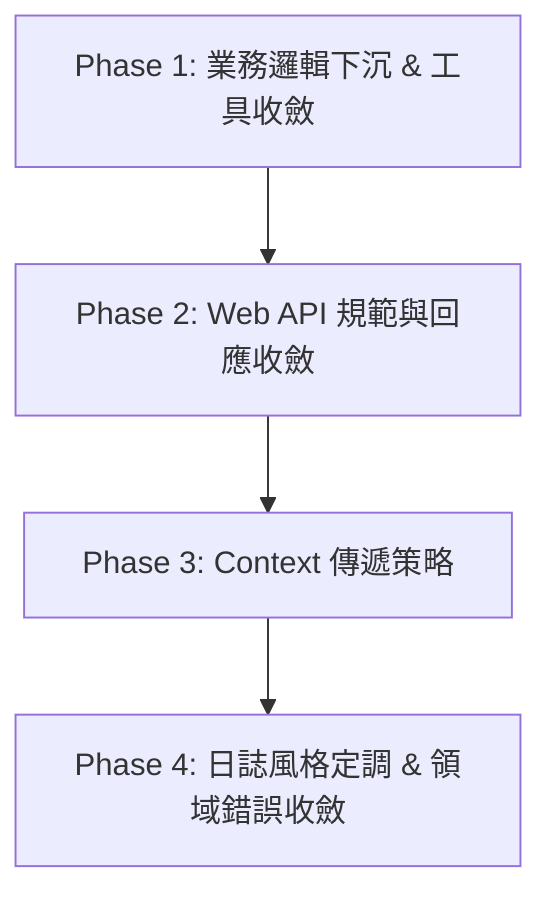

# 後端架構與風格一致性重構計畫 (Backend Consistency Refactor Plan)

本文檔記錄 Argus 後端為達成程式碼風格一致、職責清晰、高內聚低耦合所規劃的四階段重構藍圖。

---

## 背景與現狀分析

Argus 經歷多個 Phase 的快速迭代，在 Phase 24 完成了重要的第一階段分層重構（抽離出 `internal/service` 與 15 個 `XxxStore` 介面，並引入 `/api/v1` 與通知中心）。然而，目前後端仍存在幾個跨套件的不一致與過渡期痕跡：

1. **商業邏輯未完全下沉**：
   - `internal/web` 內仍包含了大量非 Web 傳輸層的領域計算（如 PnL 時間序列計算、交易回合切分、MAE/MFE 回測指標、持有天數分佈統計等）。
   - `internal/bot` 與 `internal/web` 重複實作了交易回合切分（`segmentRounds` vs `lastClosedRound`）。
   - 部分小工具（如 Ticker 正規化）在多個套件手寫重複實作。
2. **Web API 雙軌制**：Pre-v1 裸 JSON 介面（`/api/*`）與 API v1 統一 Envelope 介面（`/api/v1/*`）並存，驗證機制與錯誤格式不同。
3. **Context 傳遞斷層**：`internal/db` 與外部網路介面 `data.Provider` 完全未接收 `context.Context`，HTTP 請求與 DB 操作無法隨連線斷開或排程中斷及時取消。
4. **日誌與錯誤顆粒度分歧**：
   - 門面為 `log/slog`，但專案有 300+ 處呼叫仍使用 Printf-style (`logger.Infof/Errorf`)。
   - 部分 Service 定義了標準哨兵錯誤與自訂 Error 結構，部分模組則隨手拋出未定義哨兵的動態字串錯誤。

---

## 重構階段規劃

---

### Phase 1: 業務邏輯下沉與重複工具收斂 (Business Logic Extraction)
**目標**：讓 Delivery Adapters（`web`, `bot`, `mcptools`）徹底擺脫領域計算與重複代碼，計算邏輯 100% 移入 `internal/service`。

- [x] **1.1 工具函式去重（Ticker Normalization）**
  - 將所有股票代碼正規化統一至 `service.NormalizeTicker(rawTicker string) (string, error)`。
  - 移除 `internal/mcptools/tools.go` 的本地 `normalizeTicker`。
  - 替換 `internal/bot/handlers.go` 中 10+ 處手寫的 `strings.ToUpper(strings.TrimSpace(ticker))`。
- [x] **1.2 交易回合模型下沉（Round Trip Segmentation）**
  - 在 `internal/service` 中統一 `Round` 結構體與切分演算法（`SegmentRounds`, `LastClosedRound`, `WeightedAvgPrice`）。
  - 消除 `internal/web/rounds.go` 與 `internal/bot/handlers.go` 的重疊實作。
  - 統一 `sell_followup.go` 與 `/review` 的交易回合資料來源。
- [x] **1.3 損益與統計分析下沉至 `AnalyticsService`**
  - 將 P&L 時間序列分析（`DailyPnL`, `CumulativePnL`, `DrawdownSeries`, `PeriodReturnPct`, `WinRate`, `ProfitFactor`, `Expectancy`, `MaxDrawdownAbs`）從 `internal/web/pnl.go` 下沉至 `internal/service`。
  - 將 MAE/MFE 運算從 `internal/web/maefe.go` 下沉至 `internal/service`。
  - 將分佈統計（`HoldingDaysDistribution`, `ReturnDistribution`）從 `internal/web/distributions.go` 下沉至 `internal/service`。
  - 建立 `AnalyticsStore` 介面與 `AnalyticsService`，由 `*db.DB` 實作資料存取。
  - `internal/web` 轉為純 HTTP 傳輸適配層，負責參數解構、調用 Service、封裝 JSON 回應。
- [x] **1.4 驗證現有測試覆蓋**
  - 確保所有單元測試（包含 `service`, `web`, `bot`）全部通過且無行為破壞。

---

### Phase 2: Web API 規範與回應協定收斂 (Web API Protocol Unification)
**目標**：明確 Pre-v1 (`/api/*`) 與 API v1 (`/api/v1/*`) 的關係，推進一致的回應結構與路由規範。

- [x] **2.1 API 雙軌架構與長期演進策略 (Dual-Track API Architecture & Evolution Strategy)**
  - **定調雙軌分工**：
    - **Pre-v1 內部 API (`/api/*`)**：專供 React SPA 儀表板使用。採取扁平裸 JSON (Bare JSON) 視圖模型（ViewModel），直接對應 UI 渲染所需結構，長期保留維護，不強制為 SPA 增加額外 envelope 包裝，避免前端無謂的反序列化開銷與大規模 TypeScript 重構風險。錯誤回應全數標準化為 `{"error": "<message>"}`。
    - **API v1 公開 API (`/api/v1/*`)**：供外部整合、行動客戶端（Mobile App）、自動化腳本及 CLI 存取。全面強制採用標準封套 Envelope（`{"success": bool, "data": any, "error": string, "timestamp": int64}`）。
- [x] **2.2 錯誤處理與回應格式標準化 (Response Protocol Standardization)**
  - 建立 [`internal/web/response.go`](file:///Users/yoch/Desktop/side_project/argus/internal/web/response.go)，收斂所有 Web 回應與請求解構 Primitive：
    - Pre-v1: `writeJSON`, `writeError` (回傳 `errorResponse`), `decodeJSON`
    - API v1: `apiResponse`, `writeAPIOK`, `writeAPIResponse`, `writeAPIError`, `decodeAPIJSON`
  - 徹底消除重複實作：從 `handlers.go` 移除 `writeJSON`/`writeError`，從 `trade.go` 移除 `decodeJSON`，從 `apiv1.go` 移除 `apiResponse` 與封套 helper。
  - 收斂 `auth.go` 中唯一遺留的裸 `json.NewDecoder` 呼叫為 `decodeJSON`。
  - 將 `apiv1_resources.go` 中的手工 `apiResponse` 構建統一為 `writeAPIResponse(w, http.StatusAccepted, ...)`。
  - 統一規範 HTTP 狀態碼語意（400 格式驗證不合、401 未認證、403 唯讀、404 不存在或寫入端點未啟用、409 伺服器狀態衝突、500 內部錯誤、503 上游服務未配置）。
- [x] **2.3 路由宣告、OpenAPI 規格與單元測試防護 (Contract Invariant & Test Coverage)**
  - 新增 [`internal/web/response_test.go`](file:///Users/yoch/Desktop/side_project/argus/internal/web/response_test.go)，100% 覆蓋所有 response 與 decoder helper 之正常與異常情境（狀態碼、Content-Type、Envelope 結構、時間戳）。
  - 維持 `openapi_test.go` 之雙向驗證防護（`TestOpenAPICoversEveryRoute` 與 `TestOpenAPIDescribesNoPhantomRoutes`），確保 OpenAPI 規格與實作無漂移。

---

### Phase 3: Context.Context 傳遞策略 (Context Propagation Strategy)
**目標**：建立貫穿 Handler -> Service -> Data/DB 的非同步取消機制與生命週期控制。

- [ ] **3.1 外部網路抓取介面全面引入 Context**
  - 在 `data.Provider`（`GetQuote`, `GetNews`, `GetMarketMovers`）、`HistoryProvider`、`FundamentalHistoryProvider` 等介面加入 `ctx context.Context`。
  - 允許使用者取消 HTTP 連線或排程超時時立即中止外部請求，避免資源洩漏。
- [ ] **3.2 Web Handler 透傳 Request Context**
  - 將 `r.Context()` 順暢透傳至各 Service 方法與 Data Provider。
- [ ] **3.3 確立 SQLite 本地資料庫的 Context 政策**
  - 評估是否將 `internal/db` 方法全面升級為接收 `ctx`（使用 `ExecContext` / `QueryContext`）。

---

### Phase 4: 日誌風格定調與領域錯誤收斂 (Logging & Error Alignment)
**目標**：消弭日誌風格割裂，統一領域錯誤定義。

- [ ] **4.1 日誌呼叫風格定調**
  - 抉擇並落實日誌呼叫風格：
    - 方案 A：全面重構為 Go 1.21 `slog` key-value 結構化日誌（`logger.Info("msg", "ticker", t)`）。
    - 方案 B：正式確認 Printf-style 為專案慣用風格，精簡 logger 介面並消除「過渡相容」之 ambiguity。
- [ ] **4.2 領域錯誤全面哨兵化與型別化**
  - 盤點所有 Service 拋出的錯誤，建立完整的 Sentinel Errors（`var Err... = errors.New(...)`）。
  - 對於需要附帶上下文資訊的錯誤（如價格超標、日期無效），定義專屬 Error Struct 並實作 `Is(target error) bool`。
  - 取代散落各處的動態字串錯誤（`fmt.Errorf("...")`）。

---

## 執行檢核與追蹤

| 階段 | 狀態 | 預計產出 |
| :--- | :---: | :--- |
| **Phase 1: 業務邏輯下沉 & 工具收斂** | 已完成 | `internal/service/round.go`, `internal/service/pnl.go`, `internal/service/maefe.go`, `internal/service/analytics.go` |
| **Phase 2: Web API 規範收斂** | 已完成 | `internal/web/response.go`, `internal/web/response_test.go`, Pre-v1/v1 協定收斂 |
| **Phase 3: Context 傳遞策略** | 待執行 | `data.Provider` 介面升級、Context 透傳 |
| **Phase 4: 日誌與錯誤收斂** | 待執行 | 全域日誌風格定調、領域哨兵錯誤補齊 |
